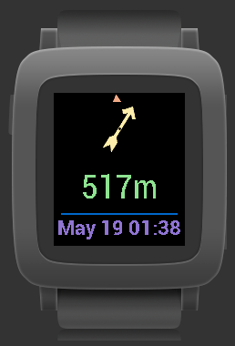

# pebble-navigation

Application that connect Pebble Watch and Navigational (Mostly GC) apps

Edited for imperial and metric units.

Get it in the Pebble Store: xxx

# Creators
- Originally created by [WebMajstr-](https://github.com/WebMajstr-/pebble-navigation).
- Updated by [jas-b](https://github.com/jas-b/pebble-navigation) (adding colors).
- Made ready for the [new Pebble store](https://apps.repebble.com) by [CaCO3](https://github.com/caco3/pebble-navigation) + Enhancements.

# Pebble Store
- Original version (non-functional with 2026 companion app): https://apps.repebble.com/navigation-geocaching-for-pebble_52cb3d92b13828a9e4000090
- New version: xxx
